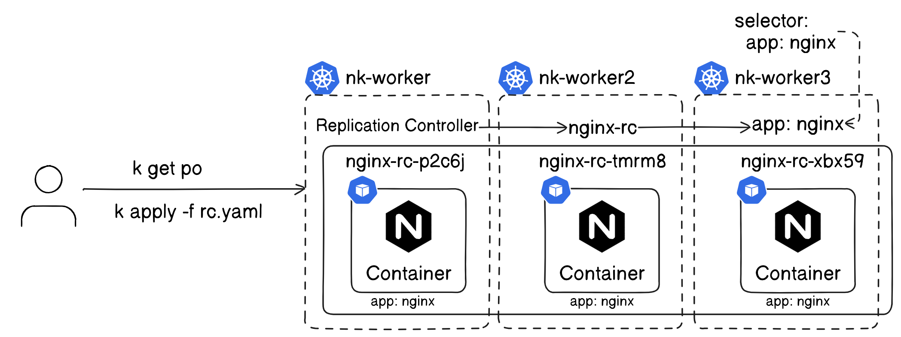
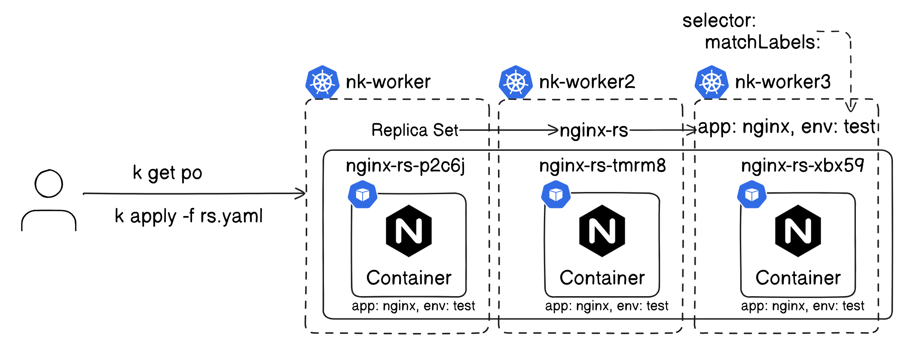
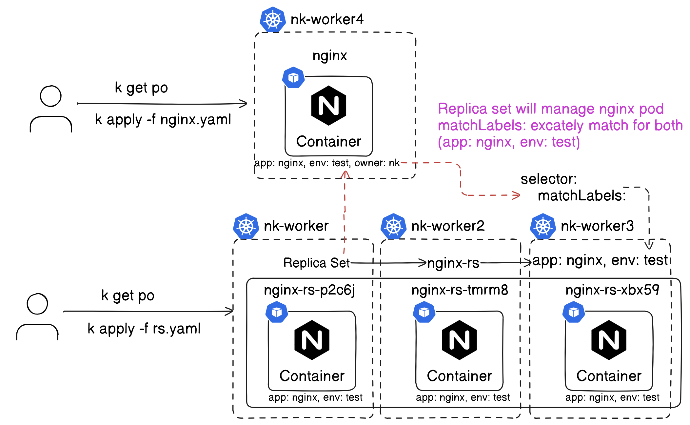
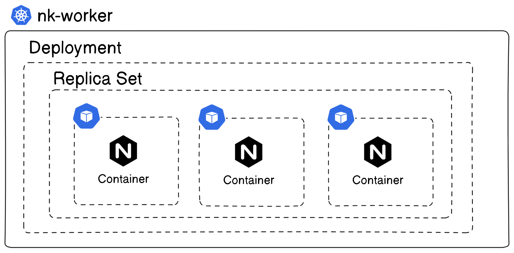
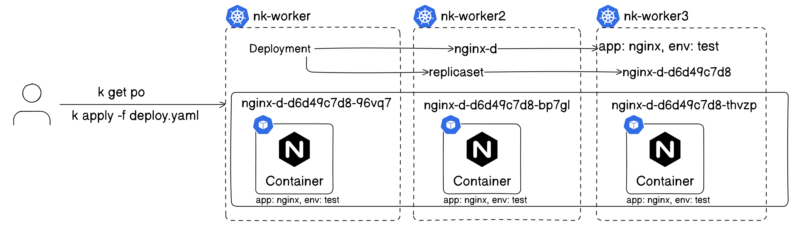

## Kubernetes

### Replication Controller
Make sure that specified number of pod replicas are running at any time.

- preffer this for High avaliability

Note: 
- Replication Controllor will manage pod's created by Replication Controller only.
- if we change Image with existing rc, we need to delete existing POD
#### Stuck some where
```
kubectl explain rc 
```
```
apiVersion: v1
kind: ReplicationController
metadata:
  name: nginx-rc
spec:
  replicas: 3
  selector:
    app: nginx
  template:
    metadata:
      name: nginx-t
      labels:
        app: nginx
    spec:
      containers:
      - name: nginx-c
        image: nginx
```
```
kubectl get rc
NAME       DESIRED   CURRENT   READY   AGE
nginx-rc   3         3         3       64s
```
```
kubectl get pods
NAME             READY   STATUS    RESTARTS   AGE
nginx-rc-h52qx   1/1     Running   0          3m55s
nginx-rc-tqvf8   1/1     Running   0          3m55s
nginx-rc-xc5mw   1/1     Running   0          3m55s
```

### Replica Set
It will manage pods, eventhoe it was not created by replicaset -- with matchLabels
- if we change Image with existing rc, we need to delete existing POD
```
kubectl explain rs
```
#### POD 
```
apiVersion: v1
kind: Pod
metadata:
  name: nginx
  labels:
    app: nginx
    env: test
    owner: nk
spec:
  containers:
  - image: nginx
    name: nginx
```
#### replicaset
```
apiVersion: apps/v1
kind: ReplicaSet
metadata:
  name: nginx-rs
  labels:
    app: nginx
    env: test
spec:
  replicas: 2
  selector:
    matchLabels:
      app: nginx
      env: test
  template:
    metadata:
      name: nginx-t
      labels:
        app: nginx
        env: test
    spec:
      containers:
      - name: nginx-x
        image: nginx
        ports:
        - containerPort: 80
```
```
kubectl apply -f nginx.yaml 
pod/nginx created
```
```
kubectl get po --show-labels
NAME    READY   STATUS    RESTARTS   AGE   LABELS
nginx   1/1     Running   0          16s   app=nginx,env=test
```
```
kubectl apply -f rs.yaml 
replicaset.apps/nginx-rs created
```
#### replicaset will identify POD, as it's matchLables matches, not created 2 replicas from replicaset.
```
kubectl get po --show-labels
NAME             READY   STATUS    RESTARTS   AGE    LABELS
nginx            1/1     Running   0          119s   app=nginx,env=test,owner=nk
nginx-rs-lftj9   1/1     Running   0          66s    app=nginx,env=test
```
```
kubectl delete po nginx
pod "nginx" deleted
```
```
kubectl get po --show-labels
NAME             READY   STATUS    RESTARTS   AGE     LABELS
nginx-rs-659kp   1/1     Running   0          4s      app=nginx,env=test
nginx-rs-lftj9   1/1     Running   0          2m46s   app=nginx,env=test
```
#### Flow Chart's


#### Replicaset with POD

#### Scale Replicas 
```
kubectl scale --replicas=10 rs nginx-rs

-or-

kubectl edit rs nginx-rs
```
### Deployment

```
kubectl explain deploy
```
```
kubectl create deploy deploy/nginx-new --image=nginx --dry-run=client -o yaml > deploy.yaml

kubectl apply -f deploy.yaml
```
```
kubectl get deploy
NAME      READY   UP-TO-DATE   AVAILABLE   AGE
nginx-d   3/3     3            3           6s
```
```
kubectl get rs
NAME                DESIRED   CURRENT   READY   AGE
nginx-d-d6d49c7d8   3         3         3       62s
```
```
kubectl get pods
NAME                      READY   STATUS    RESTARTS   AGE
nginx-d-d6d49c7d8-96vq7   1/1     Running   0          112s
nginx-d-d6d49c7d8-bp7gl   1/1     Running   0          112s
nginx-d-d6d49c7d8-thvzp   1/1     Running   0          112s
```
#### Deployment


Note: if Image changed, I will create new POD's using Rolling Update Strategy 
```
kubectl edit deploy nginx-d
```
Note:
```
kubectl get pods --show-labels
NAME                      READY   STATUS    RESTARTS   AGE   LABELS
nginx                     1/1     Running   0          32s   app=nginx,env=test,owner=nk
nginx-d-d6d49c7d8-h7pgz   1/1     Running   0          21s   app=nginx,pod-template-hash=d6d49c7d8
nginx-d-d6d49c7d8-ls22c   1/1     Running   0          21s   app=nginx,pod-template-hash=d6d49c7d8
nginx-d-d6d49c7d8-phfkm   1/1     Running   0          21s   app=nginx,pod-template-hash=d6d49c7d8
```
```
kubectl get all
NAME                          READY   STATUS    RESTARTS   AGE
pod/nginx                     1/1     Running   0          10m
pod/nginx-d-d6d49c7d8-h7pgz   1/1     Running   0          10m
pod/nginx-d-d6d49c7d8-ls22c   1/1     Running   0          10m
pod/nginx-d-d6d49c7d8-phfkm   1/1     Running   0          10m

NAME                 TYPE        CLUSTER-IP   EXTERNAL-IP   PORT(S)   AGE
service/kubernetes   ClusterIP   10.96.0.1    <none>        443/TCP   19h

NAME                      READY   UP-TO-DATE   AVAILABLE   AGE
deployment.apps/nginx-d   3/3     3            3           10m

NAME                                DESIRED   CURRENT   READY   AGE
replicaset.apps/nginx-d-d6d49c7d8   3         3         3       10m
```
#### Update Image
Note: it will not update local yaml
```
kubectl set image deployment/nginx-d nginx-c=nginx:1.9.1 
```
#### Rollout History
```
kubectl rollout history deploy/nginx-d
deployment.apps/nginx-d 
REVISION  CHANGE-CAUSE
1         <none>
2         <none>
```
#### Rollout 
```
kubectl rollout undo deploy/nginx-d
```
```
kubectl rollout history deploy/nginx-d
deployment.apps/nginx-d 
REVISION  CHANGE-CAUSE
2         <none>
3         <none>
```
