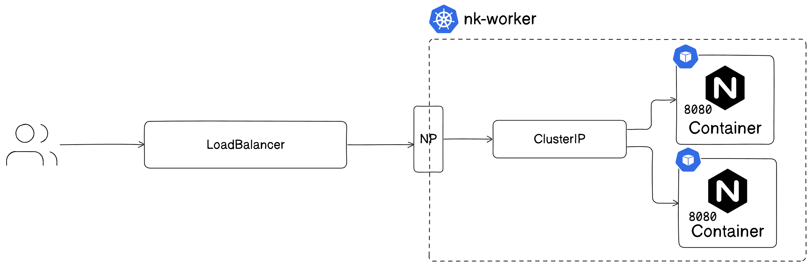
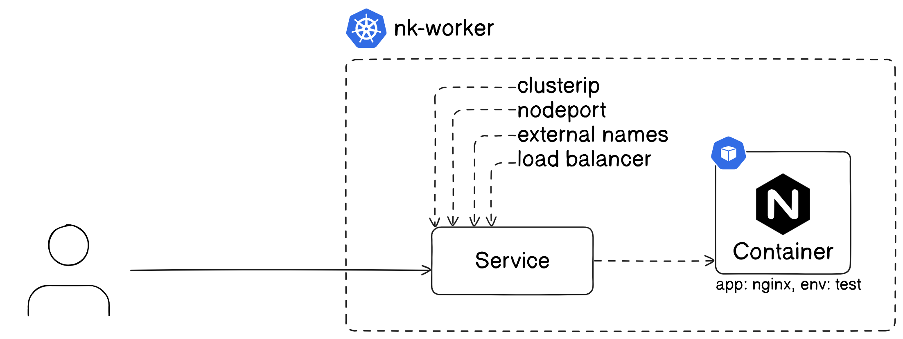
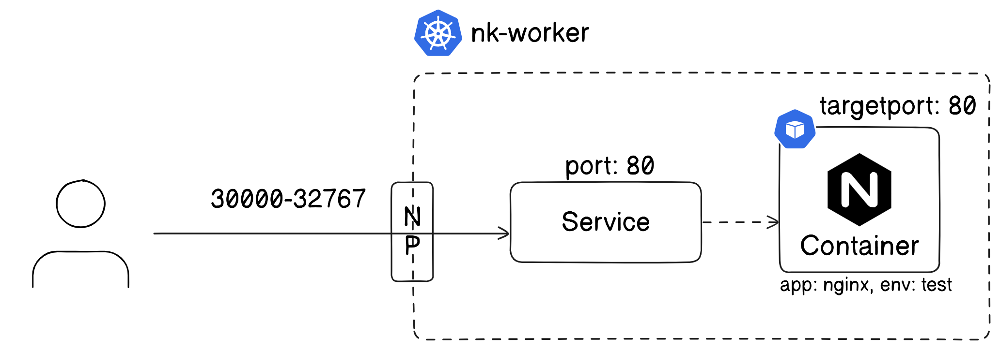
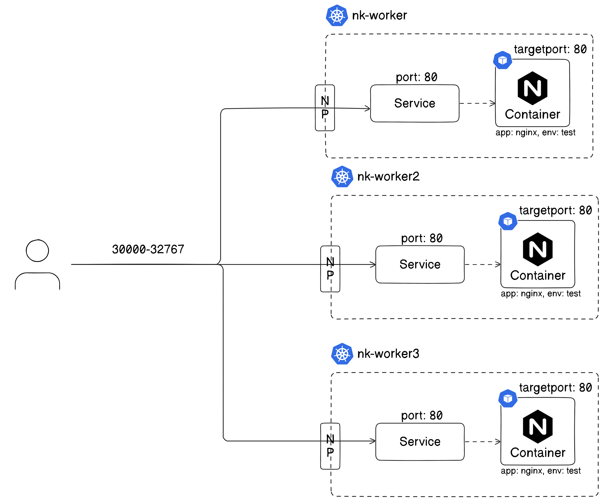
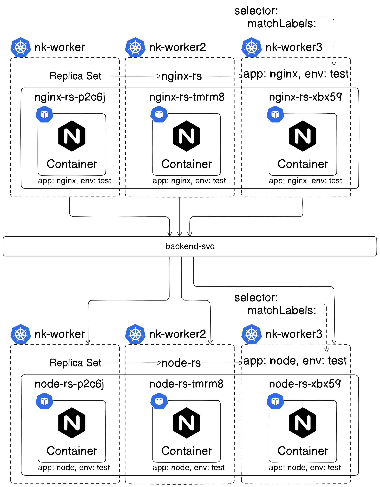
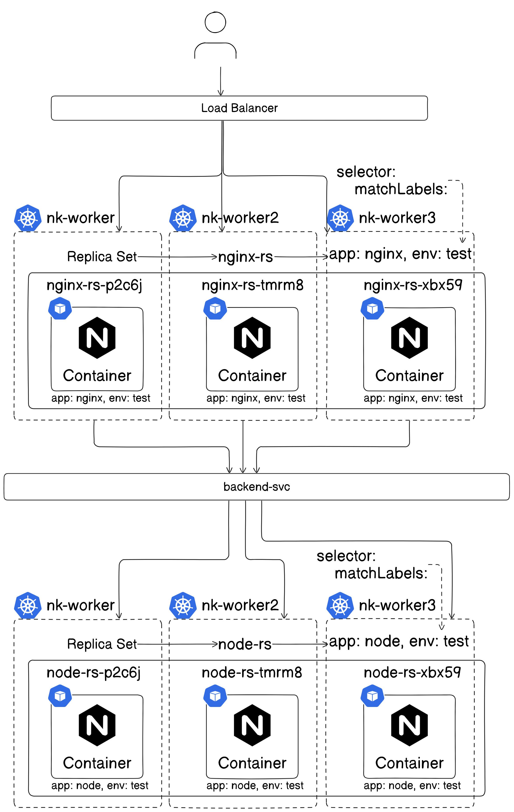
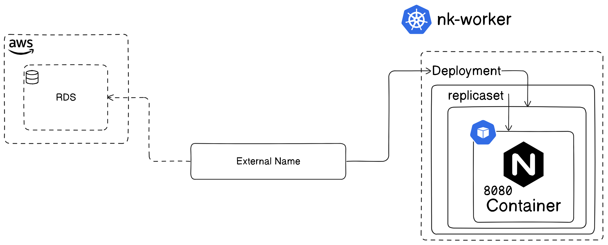

## Kubernetes

### Services


#### Types of service's


#### Expose Application to outside cluster
1. NodePort -- Range(30000-32767)
- Expose Paticular Port on all nodes
- Expose randon port if we not specify -- nodePort: 30007


#### NodePort with 3 Nodes


```
kubectl apply -f deploy.yaml

kubectl apply -f np.yaml
```
#### Access Application
```
public-ip-any-node:NP
xx.xx.xx.xx:30007
```
2. ClusterIP
- Internal communcation with name of service
- default type of service is ClusterIP

```
kubectl apply -f c-ip.yaml 
```
```
kubectl describe svc nginx-svc-cip
```
```
kubectl get ep
```
3. LoadBalancer
- it will create external loadbalancer in cloud

```
kubectl apply -f lb.yaml 
```
4. ExternalName
- it uses cname
- connect to our external DB (inside cloud)

```
kubectl delete -f ext.yaml 
```