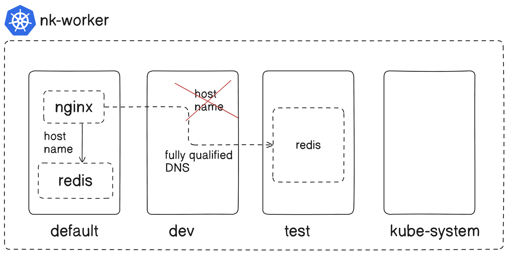

## Kubernetes
### Namespaces
```
k create ns test
k delete ns test
k get all -n test
```


Note: 
- clusterIP is cluster wide, we can ping any pod within cluster
- pods within in same ns can connect via hostname
- pod needs to connect to svc present in different ns we need to use FQDNS \

Step1:
```
k create deploy nginx-demo --image=nginx -n test
k get pods -n test -o wide
```
```
k create deploy nginx-demo --image=nginx
k get pods -o wide
```
Step2:
```
k exec -it nginx-demo-cccbdc67f-zjmnp -- bash

root@nginx-demo-cccbdc67f-zjmnp:/# echo hi from default > /usr/share/nginx/html/index.html

root@nginx-demo-cccbdc67f-zjmnp:/# curl localhost
hi from default

root@nginx-demo-cccbdc67f-zjmnp:/# curl 10.244.3.18
hi from default
```
```
k exec -it nginx-demo-cccbdc67f-qrrd5 -n test -- bash

root@nginx-demo-cccbdc67f-qrrd5:/# echo hi from test > /usr/share/nginx/html/index.html

root@nginx-demo-cccbdc67f-qrrd5:/# curl localhost
hi from test

root@nginx-demo-cccbdc67f-qrrd5:/# curl 10.244.1.15
hi from test
```
Step3:
```
root@nginx-demo-cccbdc67f-zjmnp:/# curl 10.244.3.18
hi from default

root@nginx-demo-cccbdc67f-zjmnp:/# curl 10.244.1.15
hi from test
```
```
root@nginx-demo-cccbdc67f-qrrd5:/# curl 10.244.1.15
hi from test

root@nginx-demo-cccbdc67f-qrrd5:/# curl 10.244.3.18
hi from default
```
Step4: Scale deployments
```
k scale --replicas=3 deploy/nginx-demo
k expose deploy/nginx-demo --name=nginx-svc --port=80 --target-port=80

k get pods -o wide
NAME                         READY   STATUS    RESTARTS   AGE    IP            NODE
nginx-demo-cccbdc67f-k7m54   1/1     Running   0          22s    10.244.1.16   nk-worker    
nginx-demo-cccbdc67f-n6wkc   1/1     Running   0          22s    10.244.2.14   nk-worker3   
nginx-demo-cccbdc67f-zjmnp   1/1     Running   0          9m9s   10.244.3.18   nk-worker2   

k get svc
NAME             TYPE        CLUSTER-IP    EXTERNAL-IP   PORT(S)   AGE
kubernetes       ClusterIP   10.96.0.1     <none>        443/TCP   23h
nginx-svc        ClusterIP   10.96.62.89   <none>        80/TCP    3m49s
```
```
k scale --replicas=3 deploy/nginx-demo -n test
k expose deploy/nginx-demo --name=nginx-svc-test --port=80 --target-port=80 -n test
k get svc -o wide -n test

k get pods -o wide -n test
NAME                         READY   STATUS    RESTARTS   AGE   IP            NODE         
nginx-demo-cccbdc67f-9hfnc   1/1     Running   0          9s    10.244.3.19   nk-worker2   
nginx-demo-cccbdc67f-f98ns   1/1     Running   0          9s    10.244.2.15   nk-worker3   
nginx-demo-cccbdc67f-qrrd5   1/1     Running   0          13m   10.244.1.15   nk-worker 

k get svc -n test
NAME             TYPE        CLUSTER-IP      EXTERNAL-IP   PORT(S)   AGE
nginx-svc-test   ClusterIP   10.96.162.247   <none>        80/TCP    93s
```
Step5:
```
k get po 
k exec -it nginx-demo-cccbdc67f-k7m54 -- bash
root@nginx-demo-cccbdc67f-k7m54:/# curl nginx-svc
hi from default
root@nginx-demo-cccbdc67f-k7m54:/# curl nginx-svc-test
curl: (6) Could not resolve host: nginx-svc-test
```
```
k get po -n test
k exec -it nginx-demo-cccbdc67f-9hfnc -n test -- bash
root@nginx-demo-cccbdc67f-9hfnc:/# curl nginx-svc-test
hi from test
root@nginx-demo-cccbdc67f-9hfnc:/# curl nginx-svc     
curl: (6) Could not resolve host: nginx-svc
```
Step6: IP to DNS within Cluster
```
root@nginx-demo-cccbdc67f-k7m54:/# cat /etc/resolv.conf 
search default.svc.cluster.local svc.cluster.local cluster.local
nameserver 10.96.0.10
options ndots:5

root@nginx-demo-cccbdc67f-9hfnc:/# cat /etc/resolv.conf 
search test.svc.cluster.local svc.cluster.local cluster.local
nameserver 10.96.0.10
options ndots:5
```

step7:
```
root@nginx-demo-cccbdc67f-k7m54:/# curl nginx-svc-test.test.svc.cluster.local
hi from test

root@nginx-demo-cccbdc67f-9hfnc:/# curl nginx-svc.default.svc.cluster.local
hi from default
```