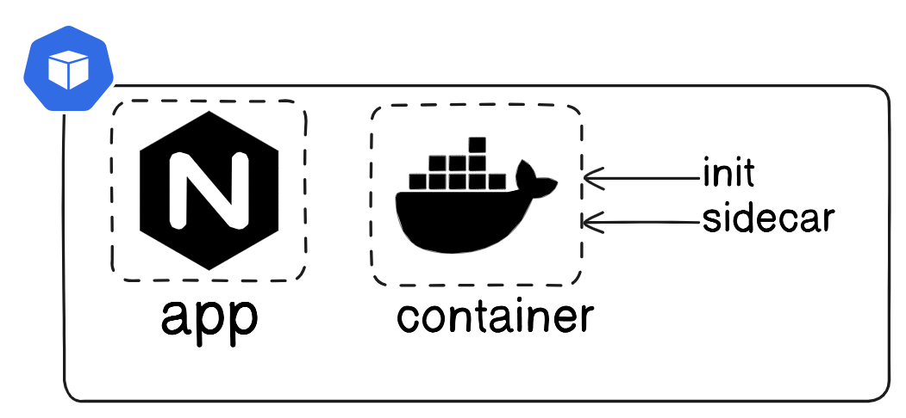

## Kubernetes

### Multi Container POD
- share same n/w, storage, resources


#### init container
- run before the app containers are started
- pod can have 1 or more init containers
- init container failed then app container will also fail
```
k apply -f init.yaml 
```
```
k get svc
NAME         TYPE        CLUSTER-IP      EXTERNAL-IP   PORT(S)   AGE
init-svc     ClusterIP   10.96.108.222   <none>        80/TCP    15s
```
```
k get po
NAME                         READY   STATUS     RESTARTS   AGE
init-pod                     0/1     Init:0/1   0          7s

k get po
NAME                         READY   STATUS    RESTARTS   AGE
init-pod                     1/1     Running   0          2m59s
```
#### Sidecar Container
- it will acts as helper container to main container
- main container will serve application
- sidecar container will push logs to cloudwatch,prometheus,...etc

#### DaemonSet
- No of replicas = No of Nodes
- A DaemonSet ensures that all Nodes run a copy of a Pod.
- even if we create new node then it will autmatically create Pod.
- Ex: Install Monitoring, Logging Agents, Kube-proxy, weave-net, calico
```
k apply -f ds.yaml 
```
```
k get daemonset
NAME           DESIRED   CURRENT   READY   UP-TO-DATE   AVAILABLE   NODE SELECTOR   AGE
nginx-daemon   3         3         3       3            3           <none>          41s
```
```
k get ds -A
NAMESPACE     NAME           DESIRED   CURRENT   READY   UP-TO-DATE   AVAILABLE   NODE SELECTOR            AGE
default       nginx-daemon   3         3         3       3            3           <none>                   99s
kube-system   kindnet        4         4         4       4            4           kubernetes.io/os=linux   25h
kube-system   kube-proxy     4         4         4       4            4           kubernetes.io/os=linux   25h
```