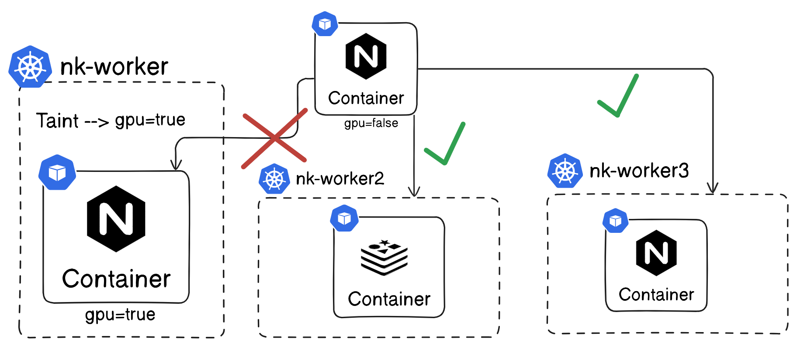
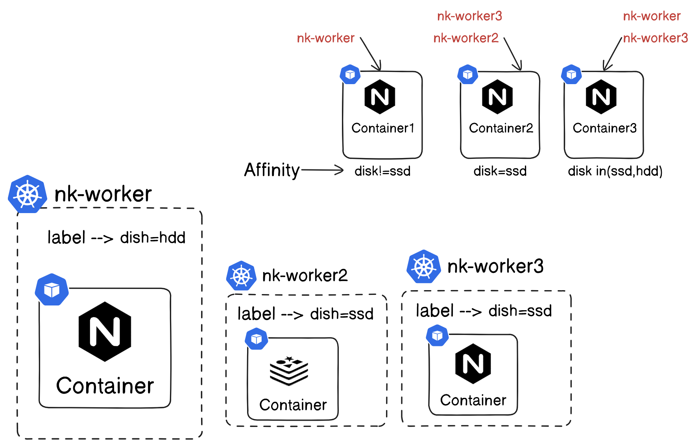

## Kubernetes

### Taint


Note:
- if node has toleration then only it will accept pod
- we are telling node to accept pod only it has toleration
- taint      -- Node
- toleration -- pod 
Note: 
- what if toleration pod scheduled to other node, if that node was not have any taint
- No guarantee to schedule at paticular node 
- solution: selectors

Effect:
- NoSchedule       -- no new pods, keep existing pods
- NoExecute        -- no new pods, existing will be evicted
- PreferNoSchedule -- try not to schedule, but no gurantee

Note: by default master node have taint ==> NoSchedule

#### Taint Node
```
k taint node nk-worker gpu=true:NoSchedule
k taint node nk-worker2 gpu=true:NoSchedule
k taint node nk-worker3 gpu=true:NoSchedule

k describe node nk-worker2 | grep -i taint
Taints:             gpu=true:NoSchedule
```
#### create pod without toleration
```
k run nginx --image=nginx

k get po
NAME    READY   STATUS    RESTARTS   AGE
nginx   0/1     Pending   0          25s

error:
1 node(s) had untolerated taint {node-role.kubernetes.io/control-plane: }
3 node(s) had untolerated taint {gpu: true}
preemption: 0/4 nodes are available: 4 Preemption is not helpful for scheduling.
```
```
k apply -f toleration.yaml 

k get po
NAME    READY   STATUS    RESTARTS   AGE
nginx   0/1     Pending   0          5m12s
redis   1/1     Running   0          34s
```
#### untaint node
```
k taint node nk-worker gpu=true:NoSchedule-
node/nk-worker untainted
```
#### nginx was scheduled in nk-worker
```
k get po 
NAME    READY   STATUS    RESTARTS   AGE
nginx   1/1     Running   0          7m47s
redis   1/1     Running   0          3m9s

k describe po nginx
Node:             nk-worker/172.18.0.4
```
### Selectors
- Add label to pod gpu=fales then match with node labels
- pods take decision on which node it needs to go 

Note: limitations of nodeSelector
- cant use expressions, logical operations, add more conditions to schedule 1 or more nodes
- solution: nodeAffinity and nodeAntiAffinity
```
apiVersion: v1
kind: Pod
metadata:
  labels:
    run: redis-selector
  name: redis-selector
spec:
  containers:
  - image: redis
    name: redis-selector
  nodeSelector:
    gpu: "false"
```
```
k get po
NAME             READY   STATUS    RESTARTS   AGE
redis-selector   0/1     Pending   0          4s

error: 
1 node(s) had untolerated taint {node-role.kubernetes.io/control-plane: }, 
3 node(s) didn't match Pod's node affinity/selector. preemption: 0/4 nodes are available: 
4 Preemption is not helpful for scheduling.
```
#### Add label to nodes
```
k get nodes --show-labels | grep gpu=false

k label node nk-worker gpu=false

k get nodes --show-labels | grep gpu=false
nk-worker          Ready    <none>          38h   v1.31.0   beta.kubernetes.io/arch=amd64,beta.kubernetes.io/os=linux,gpu=false,kubernetes.io/arch=amd64,kubernetes.io/hostname=nk-worker,kubernetes.io/os=linux
```
```
k get po -o wide
NAME             READY   STATUS    RESTARTS   AGE     IP           NODE        NOMINATED NODE   READINESS GATES
redis-selector   1/1     Running   0          3m32s   10.244.1.4   nk-worker
```
### Node Affinity

- what happen if user change labels after scheduling pods
- label --> disk=ssd to disk=
- in case of taint & toleration's it will evict pod
- 2 properties will take care of above situation
  - requiredDuringSchedulingIgnoredDuringExecution
  - preferredDuringSchedulingIgnoredDuringExecution
- after scheduling it will ignore about labels :: IgnoredDuringExecution

Note: 
- if want pod to be scheduled in paticular node :: requiredDuringSchedulingIgnoredDuringExecution
- if want pod to be scheduled in any node ::  preferredDuringSchedulingIgnoredDuringExecution
```
k get nodes --show-labels | grep disk=
```
```
apiVersion: v1
kind: Pod
metadata:
  labels:
    run: redis
  name: redis
spec:
  containers:
  - image: redis
    name: redis
  affinity:
    nodeAffinity:
      preferredDuringSchedulingIgnoredDuringExecution:
      - weight: 1
        preference:
          matchExpressions:
          - key: disk
            operator: In
            values:
```
we are using `preferredDuringSchedulingIgnoredDuringExecution` not mandatory to have match label to node.
```
k apply -f affinity.yaml 

k get po -o wide
NAME    READY   STATUS    RESTARTS   AGE   IP           NODE
redis   1/1     Running   0          3s    10.244.1.3   nk-worker
```
Example2:
```
apiVersion: v1
kind: Pod
metadata:
  labels:
    run: redis
  name: redis
spec:
  containers:
  - image: redis
    name: redis
  affinity:
    nodeAffinity:
      requiredDuringSchedulingIgnoredDuringExecution:
        nodeSelectorTerms:
        - matchExpressions:
          - key: disk
            operator: In
            values:
            - hdd
```
we are using `requiredDuringSchedulingIgnoredDuringExecution`, it will not schedule pod unless if found match label
```
k get po
NAME    READY   STATUS    RESTARTS   AGE
redis   0/1     Pending   0          4s
```
#### Add label to nodes
```
k label node nk-worker disk=hdd
node/nk-worker labeled

k label node nk-worker2 disk=ssd
node/nk-worker2 labeled

k label node nk-worker3 disk=ssd
node/nk-worker3 labeled
```
```
k get nodes --show-labels | grep disk=
nk-worker          Ready    <none>          2d    v1.31.0   disk=hdd
nk-worker2         Ready    <none>          2d    v1.31.0   disk=ssd
nk-worker3         Ready    <none>          2d    v1.31.0   disk=ssd
```
```
k get po
NAME    READY   STATUS    RESTARTS   AGE
redis   1/1     Running   0          2m
```
#### Remove label to nodes
```
k label node nk-worker3 disk-
node/nk-worker3 unlabeled

$ k label node nk-worker2 disk-
node/nk-worker2 unlabeled

$ k label node nk-worker disk-
node/nk-worker unlabeled

k get nodes --show-labels | grep disk=
```
## Note: Best Practice use combination of NodeAffinity and taints