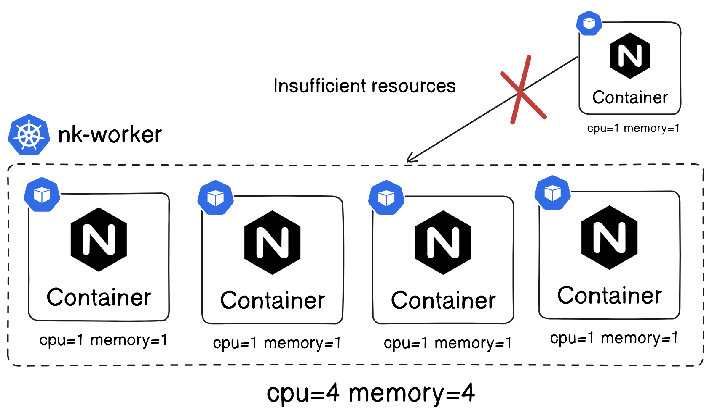
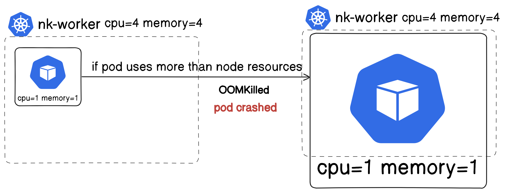

## Kubernetes

#### Requests and Limits
- requests -- soft limit
- limits   -- hard limit


### if pod require > Node resources

```
k apply -f metrics-server.yaml 

serviceaccount/metrics-server created
clusterrole.rbac.authorization.k8s.io/system:aggregated-metrics-reader created
clusterrole.rbac.authorization.k8s.io/system:metrics-server created
rolebinding.rbac.authorization.k8s.io/metrics-server-auth-reader created
clusterrolebinding.rbac.authorization.k8s.io/metrics-server:system:auth-delegator created
clusterrolebinding.rbac.authorization.k8s.io/system:metrics-server created
service/metrics-server created
deployment.apps/metrics-server created
apiservice.apiregistration.k8s.io/v1beta1.metrics.k8s.io created
```
```
k top node
NAME               CPU(cores)   CPU%   MEMORY(bytes)   MEMORY%   
nk-control-plane   146m         1%     688Mi           8%
nk-worker          21m          0%     237Mi           3%
nk-worker2         40m          0%     363Mi           4%
nk-worker3         23m          0%     235Mi           3%
```
```
k create ns mem
```
```
apiVersion: v1
kind: Pod
metadata:
  name: memory-demo
  namespace: mem
spec:
  containers:
  - name: memory-demo-ctr
    image: polinux/stress
    resources:
      requests:
        memory: "100Mi"
      limits:
        memory: "200Mi"
    command: ["stress"]
    args: ["--vm", "1", "--vm-bytes", "150M", "--vm-hang", "1"]
```
```
k top pod memory-demo -n mem
NAME          CPU(cores)   MEMORY(bytes)   
memory-demo   24m          150Mi
```
```
apiVersion: v1
kind: Pod
metadata:
  name: memory-demo-2
  namespace: mem
spec:
  containers:
  - name: memory-demo-ctr-2
    image: polinux/stress
    resources:
      requests:
        memory: "50Mi"
      limits:
        memory: "100Mi"
    command: ["stress"]
    args: ["--vm", "1", "--vm-bytes", "250M", "--vm-hang", "1"]
```
```
k get po -n mem
NAME            READY   STATUS      RESTARTS   AGE
memory-demo     1/1     Running     0          56m
memory-demo-2   0/1     OMMKilled   0          4s
```