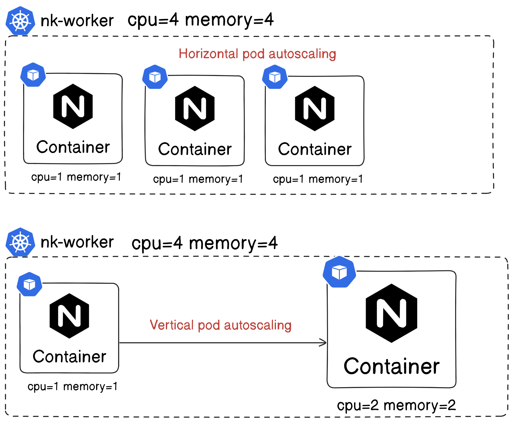
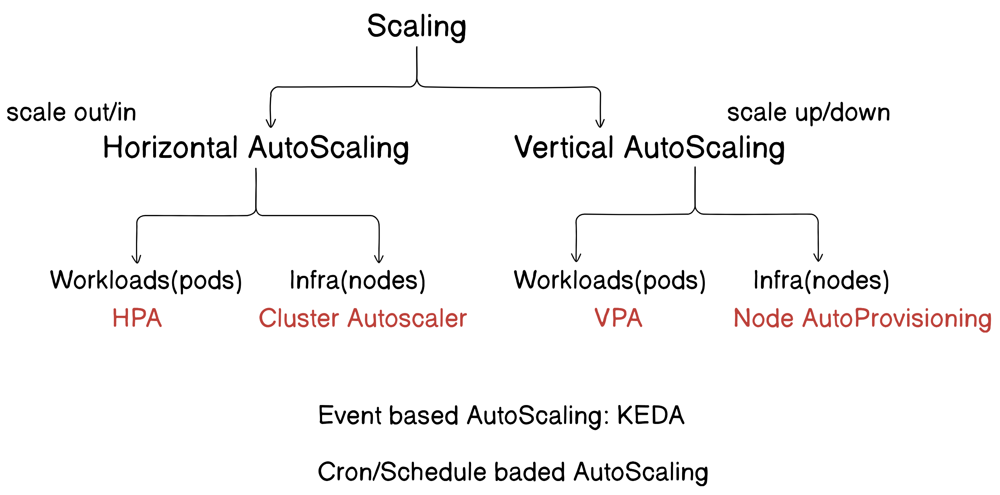

## Kubernetes

### Scaling



#### HPA
```
k apply -f metrics-server.yaml 
```
```
k apply -f deploy-hpa.yaml 
```
```
k autoscale deploy php-apache --cpu-percent=50 --min=1 --max=10

-or-

k apply -f hpa.yaml
```
```
k get hpa
NAME         REFERENCE               TARGETS       MINPODS   MAXPODS   REPLICAS   AGE
php-apache   Deployment/php-apache   cpu: 0%/50%   1         10        1          40s
```
#### Load for hpa
https://kubernetes.io/docs/tasks/run-application/horizontal-pod-autoscale-walkthrough/
```
kubectl run -i --tty load-generator --rm --image=busybox:1.28 --restart=Never -- /bin/sh -c "while sleep 0.01; do wget -q -O- http://php-apache; done"
```
```
k get hpa
NAME         REFERENCE               TARGETS       MINPODS   MAXPODS   REPLICAS   AGE
php-apache   Deployment/php-apache   cpu: 167%/50%   1         10        4          41m
```