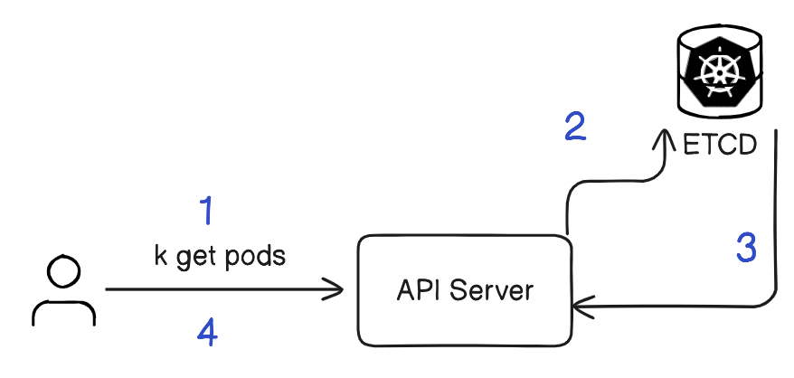
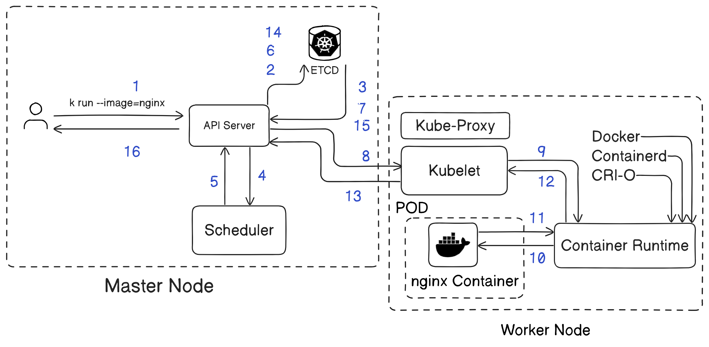

## Let's Start with Kubernetes

### Kubernetes
A Kubernetes cluster consists of two main components: 
- Control Plane (Master Node) 
- Node (Worker Nodes) 
-  Kubernetes is an open source container orchestration software with which you can manage, coordinate, and schedule containers at scale

### Kubernetes Architecture


#### Get Pod


#### Run Pod


#### Create Kubernetes Cluster with Kind (Local Setup)
```
# Create CLuster 2 ways
-----------------------
kind create cluster --name my-k8s
kind delete cluster --name my-k8s

-OR-
kind create cluster --name nk --config yamls/cluster.yaml
kind delete cluster --name nk

-OR- for NodePort
kind create cluster --name nk --config yamls/cluster-np.yaml
```

#### Switch between Cluster's
```
# To See All Clusters
kubectl config get-contexts

CURRENT   NAME            CLUSTER                           AUTHINFO       NAMESPACE
*         kind-my-k8s     kind-my-k8s                       kind-my-k8s
          kind-nk         kind-nk                           kind-nk
```
```
# Switch to Cluster
kubectl config use-context kind-nk

# To See All Clusters
kubectl config get-contexts

CURRENT   NAME            CLUSTER                           AUTHINFO       NAMESPACE
         kind-my-k8s     kind-my-k8s                       kind-my-k8s
*        kind-nk         kind-nk                           kind-nk
```
#### Run Nginx Container -- Imperative
```
kubectl run nginx --image nginx
kubectl get pods
kubectl delete pod nginx
```
#### Dry Run with json/yaml
```
kubectl run nginx --image=nginx --dry-run=client -o yaml
```
```
apiVersion: v1
kind: Pod
metadata:
  creationTimestamp: null
  labels:
    run: nginx
  name: nginx
spec:
  containers:
  - image: nginx
    name: nginx
    resources: {}
  dnsPolicy: ClusterFirst
  restartPolicy: Always
status: {}
```

#### Run Nginx Container -- Declarative (json/yaml)
```
apiVersion: v1
kind: Pod
metadata:
  name: nginx
  labels:
    env: test
spec:
  containers:
  - image: nginx
    name: nginx
```
```
kubectl apply -f nginx.yaml
kubectl get pods -o wide
kubectl get pods --watch
```
#### See Labels
```
kubectl get pod --show-labels
NAME    READY   STATUS    RESTARTS   AGE   LABELS
nginx   1/1     Running   0          29s   env=test
```
#### More Info about POD
```
kubectl describe pod nginx
```
#### Edit POD
Note: if we change Image, we need to delete existing POD
```
kubectl edit pod nginx
```
#### Login into POD
```
kubectl exec -it nginx -- sh
```